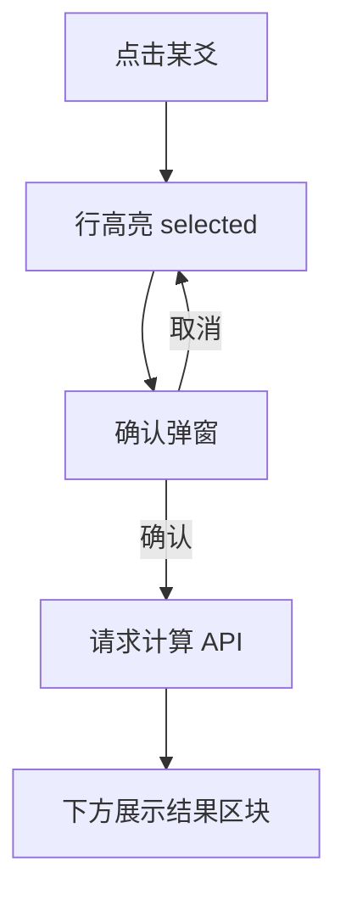

# 用神选择：交互、确认与结果展示（已确认）

## 产品已确认

- **选用神方式**：结果页**每一爻均可点击**，选中某一爻作为用神（`yongshen_yao = index + 1`，初爻=1）。
- **计算前确认**：点击选中后，**先出现确认提示**（是否以该爻为用神进行计算），用户确认后再发请求。
- **结果位置**：确认并计算成功后，在**卦盘区域下方**展示本次用神计算结果（纵向信息流：上盘、下结论）。

## 推荐确认形态

- **首选**：`AlertDialog` / 模态对话框——文案可读性强，避免误触直接扣费或打接口（若未来有成本）。
- 文案要素建议：**爻位**（如初爻、三爻）+ **该爻六亲**（来自 `yao_liuqin`），减少「点错行」的挫败感。
- 取消：清除选中态或保留选中仅关闭弹窗（二选一，实施时定一条即可并在 PRD 写一句）。

## 交互与数据流（更新）

---

# 未来规划：月日干支变量与图表

## 方向简述

- **当前**：用神计算隐含「当前时间」对应的干支语境（以后端为准）。
- **未来**：允许用户**修改月、日干支**（或等价选择器），在同一卦、同一用神下，计算**不同干支情景**下的用神强弱或指标，并可能用**图表**对比多条结果。

## 页面设计推荐（与现版兼容、可演进）

### 1. 纵向分区（单页完成，少跳转）

自上而下建议固定为四段（未来也不拆页，避免看盘与对比割裂）：

1. **卦例信息**：标题、起卦时间（现有）。
2. **排盘核心区**：本卦六爻（可点选用神）+ 变卦等（保持现有 grid 结构）。
3. **用神操作带**（MVP 可极薄）：一行说明「已选用神：X 爻 · 六亲」+ 主按钮「重新选爻」或仅在未确认时出现确认弹窗即可；未来在此条右侧或下方塞 **「高级：调整月日干支」** 折叠面板。
4. **用神结果区**：本次计算的文字/数值摘要；未来同一区块下方接 **图表**。

这样 **MVP 只实现 2→3（确认）→4 的空态与有数据态**；未来加干支只在第 3 段展开，第 4 段加图表，不动 1–2 的主结构。

### 2. 「高级参数」与图表的布局

- **干支修改**：放在 **折叠 `Collapsible` / `Accordion`** 内，标题如「按其他月日干支试算」，避免默认界面变复杂。
- **图表**：
  - **横轴**：情景序号或可选「月支/日支」标签（以后端返回维度为准）。
  - **纵轴**：指标（如用神计数、旺衰分等——以后端字段为准）。
  - 移动端：**图表区允许横向滚动**（与 UI 规则一致），不强行压缩坐标轴字号。
  - 桌面端：图表宽度 `max-w-full`，与上方 Card 同宽，视觉一条线。

### 3. 状态与性能（面向未来）

- **单次试算**：仍是一次请求带 `liuyao_id`、`yongshen`、可选 `yue_gan_zhi` / `ri_gan_zhi`（具体名以后端契约为准）。
- **多情景批量**：若未来一次返回多点多序列，前端列表/图表一次渲染；若需用户点「生成对比」再批量请求，在高级区放按钮即可，避免进页就狂打接口。

### 4. 信息架构原则

- **排盘永远是主视觉**；用神结果与图表是**派生信息**，放在下方，滚动自然。
- 未来图表再多，也**不要**用复杂 dashboard 替代六爻 grid；grid 稳定优先（见 [UI.mdc](../rules/UI.mdc)）。

---

## 历史结论摘要（仍有效）

- 点选爻位与后端 `yongshen`（爻位）一致，无需六亲下拉消解歧义。
- 世应快捷可作为后续小优化，不阻塞 MVP。

## 与仓库文档对齐

- 已与 **[PRD.md](../../PRD.md)**、**[architecture.md](../../architecture.md)**、**[草稿.md](../../草稿.md)** 同步（用户流程、接口参数语义、代理说明、未来干支占位）；**[README.md](../../README.md)** 已增加 `.cursor/plans/` 与 `草稿.md` 索引。

## 前端分步实现（小功能拆分）

### Phase 1：纯前端交互壳（不打接口）

1. 在结果页客户端交互层加入基础状态：
  - `selectedYao`：当前选中爻位（1–6）
  - `confirmOpen`：确认弹窗开关
  - `calcLoading`、`calcResult`、`calcError`：为后续请求预留
2. 本卦六爻行支持点击选中与高亮（仅样式+状态，不触发网络请求）。
3. 点击后弹确认框，展示「第 X 爻 + 六亲」，验证交互路径闭环。

### Phase 2：最小接口接入

1. 确认后再调用同源 API（建议 `app/api/result/count-yongshen` 代理或既有路径扩展）。
2. 仅传最小参数：`liuyao_id` + `yongshen`（1–6）。
3. 处理基础失败态：网络失败、4xx/5xx、字段缺失。

### Phase 3：结果区与体验收口

1. 在卦盘下方增加独立结果区：
  - 空态：未计算
  - 加载态：计算中
  - 成功态：展示数值/摘要
  - 失败态：错误提示 + 重试
2. 移动端优化：整行可点、点击反馈明显、必要时横向滚动不压缩排盘。
3. 交互保护：确认中禁用重复提交，完成后允许重新点爻再算。

### Phase 4：未来扩展位（不在本次实现）

1. 用神操作带预留「高级参数」折叠位（后续月日干支试算）。
2. 结果区预留图表容器位置，确保未来新增图表不重构页面骨架。

